### Hi 👋, I'm Divyanshu Sahu

### Glad to see you here!

My interest lies in Full Stack Development and Information Security. I am a B.Tech graduate in Computer Science from the Indian Institute of Technology, Roorkee. I was a member of InfoSecIITR (a group of security enthusiasts from IIT Roorkee). I like participating in many Capture the Flag (CTF) events. During my free time, I love reading novels (preferably fiction).

### About Me:

- 🔭 I’m currently working on Nodejs, React, Python, Flask, JavaScript
- 🌱 I’m currently learning React Native and GO
- 👨🏻‍💻 Most of my projects are available on Github
- 💬 Ask me about anything. I am happy to help
- 📫 How to reach me: dsahu1997@gmail.com
- ⚡ Fun fact: Equal is Not Always Equal in Javascript

### Connect me with:

